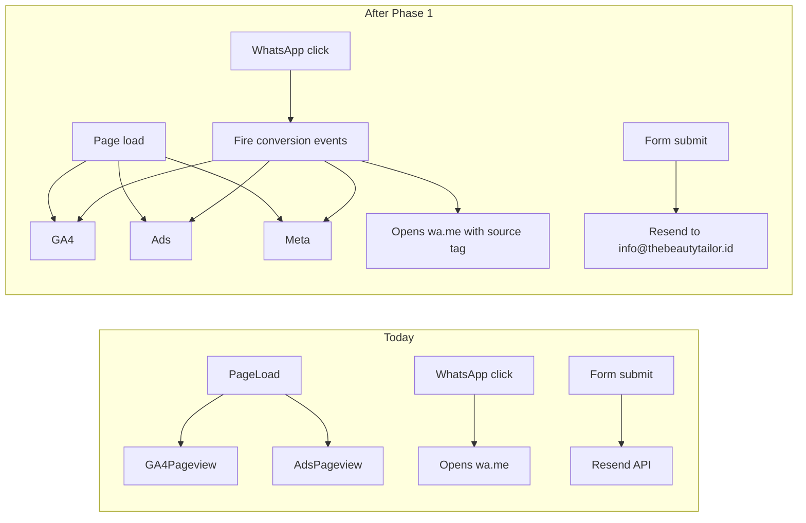
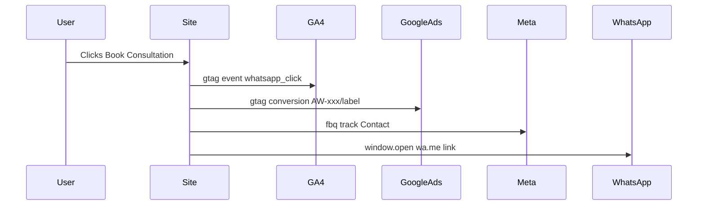

# Phase 1 — Perbaiki Ember Bocor (Tracking & Contact)

## Current state (what you already have)

Your site is a **Next.js 16 App Router** app. Some work is already done:

| Item | Status |
|------|--------|
| GA4 (`G-8LV6EM5Q4D`) | Installed in [`app/layout.tsx`](app/layout.tsx) |
| Google Ads account tag (`AW-17068113026`) | Installed in same file |
| Meta Pixel | **Missing** |
| Conversion events (WhatsApp, form) | **Missing** — only automatic pageviews fire today |
| WhatsApp links | 4 live links, inconsistent format, no tracking |
| Contact email | `hreggy@gmail.com` in [`components/contact.tsx`](components/contact.tsx) and [`app/api/send-email/route.ts`](app/api/send-email/route.ts) |



---

## Part 1 — Analytics & conversion tags

### What we will do

**1a. Meta Pixel — DONE (you)**

You have the Pixel ID. No owner action needed for Meta testing.

**1b. Google Ads conversion — developer path (no owner required yet)**

The owner already installed the **base Google tag** in [`app/layout.tsx`](app/layout.tsx). That is only half of conversion tracking.

#### What is already in the codebase (owner-installed)

```tsx
gtag('config', 'AW-17068113026');   // Google Ads account tag
gtag('config', 'G-8LV6EM5Q4D');     // GA4 property
```

| ID type | Value | In code? | What it does |
|---------|-------|----------|--------------|
| **Google Ads account tag** (often called "Conversion ID") | `AW-17068113026` | Yes | Loads gtag, enables remarketing, receives pageviews |
| **GA4 Measurement ID** | `G-8LV6EM5Q4D` | Yes | Pageviews + custom events |
| **Conversion Label** | e.g. `xYz12AbC_dEfGhIjK` | **No** | Tells Google Ads *which* conversion action fired (WhatsApp vs form) |

The label is the missing piece. It only exists inside the Google Ads account, after someone creates a conversion action. It cannot be guessed from the codebase.

Full conversion call format (what we will add later):

```js
gtag('event', 'conversion', {
  send_to: 'AW-17068113026/<CONVERSION_LABEL>'
});
```

#### What you use as a developer right now

- **Conversion ID:** `AW-17068113026` — copy from existing code, no owner needed
- **Conversion Label:** leave **empty** in `.env.local` for now — implement the code path but gate the Google Ads conversion call so it only fires when the label env var is set

```
NEXT_PUBLIC_GOOGLE_ADS_ID=AW-17068113026
NEXT_PUBLIC_GOOGLE_ADS_WHATSAPP_LABEL=          # empty until owner provides
NEXT_PUBLIC_GOOGLE_ADS_FORM_LABEL=              # empty until owner provides
```

This lets you build and test everything except the final Google Ads dashboard confirmation.

#### How to test & debug without Google Ads / GA4 dashboard access

You do **not** need the owner for any of this:

1. **Confirm base tags load (page load)**
   - Run `npm run dev`, open the site
   - Chrome DevTools → **Network** → filter `gtag` or `collect`
   - You should see requests to `googletagmanager.com/gtag/js` and `google-analytics.com/g/collect` on load

2. **Inspect the dataLayer (all gtag events)**
   - DevTools → **Console** → type `window.dataLayer`
   - After a WhatsApp click (once implemented), you should see a new entry with your custom event

3. **Google Tag Assistant** ([tagassistant.google.com](https://tagassistant.google.com))
   - Connect to your local or staging URL
   - Confirms GA4 + Google Ads **base tags** are detected (green)
   - After implementation, shows conversion events in the event stream when label is set

4. **GA4 custom events (no dashboard needed to verify firing)**
   - Network tab: filter `collect` → click WhatsApp → look for a request containing `en=whatsapp_click` (or whatever event name we use)
   - Optional: [Google Analytics Debugger](https://chrome.google.com/webstore/detail/google-analytics-debugger) extension makes these requests easier to read

5. **Meta Pixel (fully testable by you)**
   - [Meta Pixel Helper](https://chrome.google.com/webstore/detail/meta-pixel-helper) extension → green check on PageView
   - [Events Manager → Test Events](https://business.facebook.com/events_manager) → enter your URL → click WhatsApp → see `Contact` event

6. **Google Ads conversion (blocked until label exists)**
   - Without the label, the conversion call either won't fire (our gated approach) or won't map to a real conversion action
   - When ready, owner creates the action in Google Ads → Goals → Conversions → New → Website → copy label → you paste into env var → redeploy → done (no code change)

#### What to ask the owner later (one message, zero ongoing involvement)

When you're ready to go live with Google Ads conversion counting, send the owner this:

> "Please create two website conversion actions in Google Ads (Goals → Conversions): **WhatsApp Click** and **Consultation Form Submit**. Send me the conversion label for each — the short string after the slash in `AW-17068113026/XXXXX`."

That is the only thing you cannot do yourself.

**1b-owner. Owner task (deferred, ~5 min when ready)**

In Google Ads → Goals → Conversions → New conversion action → Website:
1. Create **"WhatsApp Click"** (category: Contact)
2. Create **"Consultation Form Submit"** (optional)
3. Share the **label** only (not the AW- ID — you already have that)

**1c. Add Meta Pixel to the site**

Add the Meta base code to [`app/layout.tsx`](app/layout.tsx) alongside the existing gtag scripts — same pattern, using `next/script` with `strategy="afterInteractive"`.

**1d. Move tracking IDs to environment variables (recommended)**

Replace hardcoded IDs with env vars so production/staging can differ and IDs aren't in source:

```
NEXT_PUBLIC_GA_MEASUREMENT_ID=G-8LV6EM5Q4D
NEXT_PUBLIC_GOOGLE_ADS_ID=AW-17068113026
NEXT_PUBLIC_GOOGLE_ADS_WHATSAPP_LABEL=<label from step 1b>
NEXT_PUBLIC_GOOGLE_ADS_FORM_LABEL=<optional>
NEXT_PUBLIC_META_PIXEL_ID=<pixel ID from step 1a>
RECIPIENT_EMAIL=info@thebeautytailor.id
```

Set these in your hosting provider (Vercel → Settings → Environment Variables) and locally in `.env.local`.

**1e. Create a small tracking utility**

Add something like [`lib/analytics.ts`](lib/analytics.ts) with typed helpers:

- `trackWhatsAppClick(source: 'hero' | 'nav' | 'services' | 'contact' | 'footer')` — fires GA4 event, Google Ads conversion, Meta `Contact` event
- `trackFormSubmit()` — fires form conversion events

This keeps all platform calls in one place instead of scattered across components.

### How to verify Part 1 works

#### Developer can verify alone (no dashboards)

| Tool | What to check |
|------|---------------|
| **Chrome Network tab** | Filter `collect` — page load shows GA4/Ads hits; WhatsApp click shows custom event param |
| **`window.dataLayer` in Console** | Custom events appear as new array entries after clicks |
| **Google Tag Assistant** | Base tags green on load; conversion events visible once label env var is set |
| **Meta Pixel Helper** | Pixel ID + `PageView` on load; `Contact` on WhatsApp click |
| **Meta Test Events** | Real-time event stream in Events Manager |

#### Owner / dashboard verification (optional, later)

| Tool | What to check |
|------|---------------|
| **GA4 Realtime / DebugView** | Requires GA4 property access — owner may need to invite you |
| **Google Ads → Conversions** | Shows "Recording conversions" only after label env var is set and events fire |

---

## Part 2 — Measurable WhatsApp interactions

### What we will do

**2a. Centralize WhatsApp link construction**

Create [`lib/whatsapp.ts`](lib/whatsapp.ts) with:
- One phone number constant: `6281519236835`
- A `buildWhatsAppUrl(source, message?)` helper that builds consistent `wa.me` URLs with a pre-filled message identifying where the click came from (e.g. "Hello, I'd like to book a consultation (via Hero CTA)")

Note: `wa.me` only officially supports the `text` param — UTM query params are stripped by WhatsApp. **Real attribution comes from the JavaScript click events**, not URL params.

**2b. Create a tracked WhatsApp link component**

Add [`components/whatsapp-link.tsx`](components/whatsapp-link.tsx):
- Accepts `source`, optional `message`, and children (the button/text)
- On click: calls `trackWhatsAppClick(source)` then opens the wa.me URL
- Uses `target="_blank"` and `rel="noopener noreferrer"`

**2c. Replace all inline WhatsApp links**

Update these files to use the shared component:

| File | Current issue |
|------|---------------|
| [`components/hero.tsx`](components/hero.tsx) | Hardcoded URL, no tracking |
| [`components/navigation.tsx`](components/navigation.tsx) | Desktop has link; **mobile "Book Appointment" has no link at all** |
| [`components/services.tsx`](components/services.tsx) | No pre-filled message, no tracking |
| [`components/contact.tsx`](components/contact.tsx) | No pre-filled message, no tracking |
| [`components/footer.tsx`](components/footer.tsx) | "Book Appointment" is a dead `href="#"` link |

**2d. Track the contact form as a second conversion**

In [`components/contact.tsx`](components/contact.tsx), after successful form submission, call `trackFormSubmit()` so form leads are counted separately from WhatsApp clicks.

### How to verify Part 2 works

1. **Click each WhatsApp CTA** (hero, nav desktop, nav mobile, services, contact, footer) one at a time
2. In **GA4 DebugView**, confirm a custom event like `whatsapp_click` appears with a `source` parameter for each button
3. In **Google Ads → Goals → Conversions**, status should change from "Unverified" to "Recording conversions" within 24–48 hours (or use Tag Assistant to see the conversion fire immediately)
4. In **Meta Events Manager → Test Events**, confirm `Contact` (or custom `WhatsAppClick`) fires on each click
5. Confirm the WhatsApp app opens with the correct pre-filled message mentioning the source



---

## Part 3 — Professional email (info@thebeautytailor.id)

### What we will do (two layers)

**3a. DNS & Resend setup (infrastructure — mostly outside the codebase)**

Since you selected "need help" for email setup, this must happen before or alongside the code change:

1. **Add domain to Resend** — [resend.com/domains](https://resend.com/domains) → Add `thebeautytailor.id`
2. **Add DNS records** at your domain registrar (the records Resend provides):
   - SPF (TXT record)
   - DKIM (CNAME records, usually 3)
   - Optional: DMARC (TXT record for deliverability/trust)
3. **Wait for verification** — Resend shows green "Verified" (usually 5–30 minutes, sometimes up to 48h)
4. **Create the inbox** — Resend receives email at any address on a verified domain, so `info@thebeautytailor.id` works once the domain is verified (no separate mailbox creation needed in Resend)
5. **Set env vars** on your host:
   - `RECIPIENT_EMAIL=info@thebeautytailor.id`
   - Update the `from` address in the API from `onboarding@resend.dev` to `The Beauty Tailor <info@thebeautytailor.id>` (or `noreply@thebeautytailor.id`)

**3b. Code & display updates**

| File | Change |
|------|--------|
| [`components/contact.tsx`](components/contact.tsx) line 163 | Display `info@thebeautytailor.id`, optionally wrap in `mailto:` link |
| [`app/api/send-email/route.ts`](app/api/send-email/route.ts) line 20–21 | Change default recipient and `from` address |
| [`README.md`](README.md) | Update documented default email |

### How to verify Part 3 works

1. **Visual check** — Contact section shows `info@thebeautytailor.id`
2. **Resend dashboard** — Domain shows "Verified" with all DNS records green
3. **Send test email** — Submit the contact form on the live/staging site
4. **Check inbox** — `info@thebeautytailor.id` receives the consultation request (check wherever that inbox is read — Resend dashboard → Logs, or your email client if you've set up forwarding)
5. **Check confirmation email** — The submitter receives the auto-reply, and the `from` address shows `@thebeautytailor.id` (not `@resend.dev` or `@gmail.com`)
6. **Resend Logs** — [resend.com/emails](https://resend.com/emails) shows both outbound emails as "Delivered"

---

## What we are NOT doing in Phase 1

- **WhatsApp Business API** — The plan image mentions this as the ideal long-term solution for ad-click-to-chat attribution. That requires Meta Business verification, a BSP (Business Solution Provider), and server-side webhook infrastructure. Phase 1 uses click-event tracking on `wa.me` links, which is sufficient to stop the "leaky bucket" before increasing ad spend.
- **Google Tag Manager** — Not needed since gtag.js is already working. GTM adds complexity without benefit at this stage.
- **@vercel/analytics** — Already in `package.json` but unused; optional add-on, not required for ad conversion tracking.

---

## Suggested implementation order

1. ~~**You create Meta Pixel**~~ — done
2. **You implement** tracking with Meta Pixel + GA4 events + gated Google Ads conversion (label env var empty for now)
3. **You set up** Resend domain + DNS for `thebeautytailor.id` (can run in parallel)
4. **We implement** WhatsApp link component + fix broken CTAs
5. **We update** email addresses in code + env vars
6. **We verify** using developer tools (Network tab, dataLayer, Meta Pixel Helper) — no owner needed
7. **Owner adds conversion labels** to production env when ready (~5 min, no code change)

---

## Pre-launch checklist (all three parts)

- [ ] GA4 Realtime shows active users on the live site
- [ ] Meta Pixel Helper shows green PageView on every page
- [ ] Clicking each WhatsApp button fires events in GA4 DebugView, Tag Assistant, and Meta Test Events
- [ ] Mobile nav "Book Appointment" opens WhatsApp (currently broken)
- [ ] Footer "Book Appointment" opens WhatsApp (currently dead link)
- [ ] Contact form delivers to `info@thebeautytailor.id` with professional `from` address
- [ ] Resend domain verified, emails not landing in spam
- [ ] All tracking IDs stored in environment variables on production host
